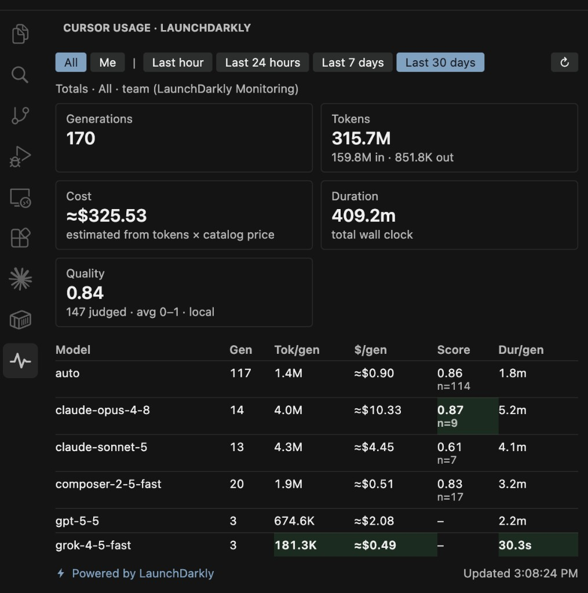

# cursor-agentcontrol-bridge

Measure AI agent activity inside the Cursor IDE and feed it into LaunchDarkly:

- **AI Config Monitoring** — team totals by model (generations, success/error, duration, tokens, LD-derived cost)
- **Local Me ledger** — per-user view inside the IDE
- **OTLP dual-emit** — per-user attributes in LaunchDarkly Observability
- **Claude Code adapter** — second provider via CLI hooks ([docs/claude-code-adapter.md](docs/claude-code-adapter.md))



```
Cursor IDE / Claude Code
 ├─ hooks (real-time) ──► duration + generation success/error (+ ledger + OTLP)
 └─ Admin API (hourly) ──► input/output/total tokens   [optional, Cursor Teams+]
                │
                ▼
   LD server SDK track()  →  AI Config (cursor-agent-usage | claude-code-usage)
   OTLP /v1/metrics|traces →  Observability (user.email × model)
```

**Recommended install:** the Cursor extension — see **[SETUP.md](SETUP.md)** for  
project key, environment, AI Config, **SDK key**, Reader **API token**, and email.

This README is the **repo / poller** path. Extension packaging details: [extension/README.md](extension/README.md).

## Prerequisites

- Node 18+.
- A LaunchDarkly account and project with:
  - AI Config `cursor-agent-usage` (variations per model)
  - **Server-side SDK key** (write / record)
  - Optional **Reader API token** (All panel) — not the same as the SDK key
  - Optional **Writer API token** only for `setup:ai-config` / `sync:models` scripts
- **Poller only:** Cursor Teams/Business/Enterprise + Cursor Admin API key  
  (Cursor → Settings → Advanced → Admin API Keys). Hooks-only still gives counts, duration, and success by model.

## Credentials cheat sheet

| Secret | Used by | Role |
|--------|---------|------|
| LD **SDK key** (server-side) | Hook / extension record path, OTLP `launchdarkly.project_id` | Write events |
| LD **API token** (Reader) | Extension **All** panel | Read `/metrics` |
| LD **API token** (Writer) | `npm run setup:ai-config`, `sync:models` | Provision configs |
| `LD_PROJECT_KEY` | Scripts + extension setting `projectKey` | Address the project |
| Cursor **Admin API** key | `poller:*` only | Token ingestion |

Details and UI command names: [SETUP.md](SETUP.md).

## Repo setup (hooks without the extension)

### 1. Install & configure

```sh
npm install
cp .env.example .env   # LD_SDK_KEY; CURSOR_ADMIN_KEY for poller; LD_API_TOKEN for scripts
```

Edit `bridge.config.json`:

- `models` — Cursor model string → AI Config variation key  
- `hookUserEmail` — your email (LD context + Me)  
- `userEmails` — poller allowlist (`[]` = everyone)  
- `otlp` — dual-emit to Observability (default enabled; optional `endpoint` / Grafana via Collector — [docs/OTLP-DUAL-EMIT.md](docs/OTLP-DUAL-EMIT.md))  
- `emitGenerationsFromPoller` — `true` only if poller runs **without** hooks  

### 2. Create the AI Config

Measurement-only; variations break out Monitoring by model:

```sh
LD_API_TOKEN=... LD_PROJECT_KEY=... npm run setup:ai-config
```

Or create in the LD UI / MCP: config key `cursor-agent-usage`, one variation per `models` entry, provider `cursor`.

### 3. Register Cursor hooks

Prefer the **extension** (it maintains `~/.cursor/hooks.json`). For repo-mode only, point hooks at this checkout’s `src/hooks/cursor-hook.mjs`, then **fully restart Cursor**.

Fail-safe: hook exits 0; logs under `.state/hook.log` (repo) or `~/.cursor/ld-agentcontrol-state/hook.log` (extension).

### 4. Schedule the poller (optional)

```sh
npm run poller:once    # or poller:loop / cron / launchd — see older docs in git history if needed
npm run poller:dry     # Admin API only, no LD writes
```

## Verification

1. `npm test` then `npm run hook:test`.
2. One live Cursor agent run → Monitoring + **Me** ledger ([SETUP.md](SETUP.md) verify section).
3. If using Observability: [docs/OTLP-DUAL-EMIT.md](docs/OTLP-DUAL-EMIT.md).

## Me vs All & reporting

- Sidebar **All** / **Me**: [SETUP.md](SETUP.md)
- Me tokens only from this machine’s ledger: [docs/SPIKE-me-remote.md](docs/SPIKE-me-remote.md)
- OTLP per-user reporting: [docs/OTLP-DUAL-EMIT.md](docs/OTLP-DUAL-EMIT.md)
- Claude Code hooks: [docs/claude-code-adapter.md](docs/claude-code-adapter.md) (`npm run install:claude-hooks`)
- Exec CSV report: `npm run report:export && npm run report:serve` ([report/](report/))
- Multi-provider roadmap: [docs/AGENT_USAGE_EVENT.md](docs/AGENT_USAGE_EVENT.md)

## Limitations

- **Tokens/cost need Teams+** for the Admin API poller. Hooks-only has no reliable token source in payloads.
- **Duration** is wall-clock prompt→stop (includes tool time).
- **Monitoring cost** is LD catalog-derived (not Cursor billed markup).
- **Measurement only** — LD does not choose Cursor’s model.
- Only one AgentControl extension version should be installed; older builds steal `hooks.json`.

## Repo layout

| Path | Purpose |
|---|---|
| [SETUP.md](SETUP.md) | Extension install + LD credentials |
| `src/hooks/cursor-hook.mjs` | Cursor hook (`beforeSubmitPrompt` + `stop`) |
| `src/hooks/claude-code-hook.mjs` | Claude Code hook (UserPromptSubmit / Stop / StopFailure) |
| `adapters/claude-code/` | Claude defaults + install path |
| `src/poller/poll-usage-events.mjs` | Admin API → token events |
| `src/lib/ldTrack.mjs` | LD `track()` + ledger + OTLP flush |
| `src/lib/agentUsageEvent.mjs` | Provider-agnostic → `$ld:ai:*` calls |
| `src/lib/otlpEmit.mjs` | OTLP/HTTP JSON dual-emit |
| `src/lib/usageLedger.mjs` | Local Me ledger |
| `extension/` | VSIX: self-installing hook + All/Me UI |
| `bridge.config.json` | Models map, otlp, emails (seeds user config) |
| `scripts/setup-*-ai-config` / `sync:*-models` | Provision AI Config + pricing |
| `report/` | Standalone ledger report UI |
| `docs/` | OTLP, Claude Code, AgentUsageEvent |
| `test/` | Unit tests |

After adding model variations, run `npm run sync:models` or Monitoring estimated cost stays `$0`.
